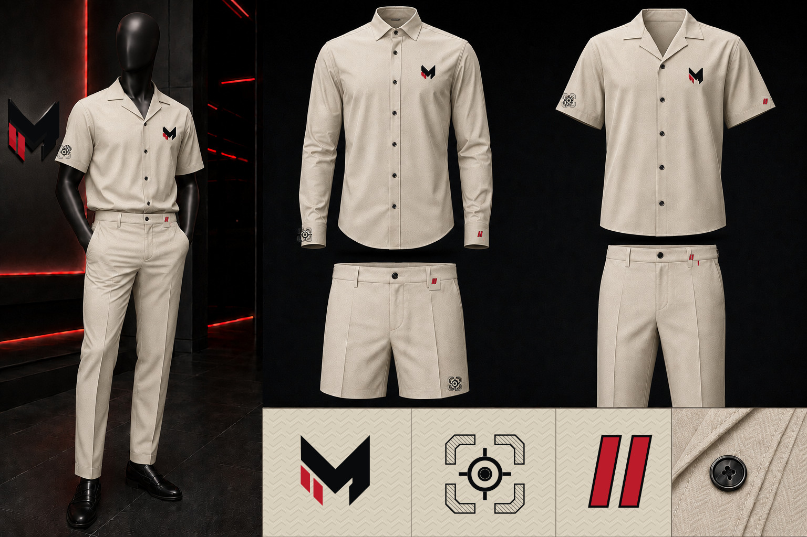

# McCluster Corp Corporate Fits Identity

This directory is the canonical visual home for McCluster corporate wardrobe colorways. It replaces the earlier generic `swag` concept location.

## CFI-01 — Authority Black

- Authority-black base garments
- Ivory structural M with integrated red Two States bars
- Tonal-black Dual Sight
- Micro red Two States punctuation
- SHA-256: `8dd9b1405ef1c662a31af02841fda0bc7c968e227a1d29de15d9be25492fc036`

## CFI-02 — Bone Herringbone

- Warm bone `#D8CEBC` luxury herringbone base garments
- Black structural M with integrated red Two States bars
- Black Dual Sight embroidery
- Micro red Two States punctuation
- Black mannequin, buttons, shoes, topstitching, and dark hardware
- SHA-256: `f5512088e1da68e3392ef98d94aba04236843b44bfc171bfde8c0631f6d5d0dc`

## Shared fit lock

Both colorways use the same silhouettes, professional proportions, placement ceiling, garment lineup, and faceless matte-black atelier mannequin. A colorway is not permission to change the cut.

## Production warning

These JPG sheets control styling and colorway direction; they are not manufacturing artwork. Every production mark must be placed from `../marks/`. Never crop, trace, or regenerate a symbol from these renders.
