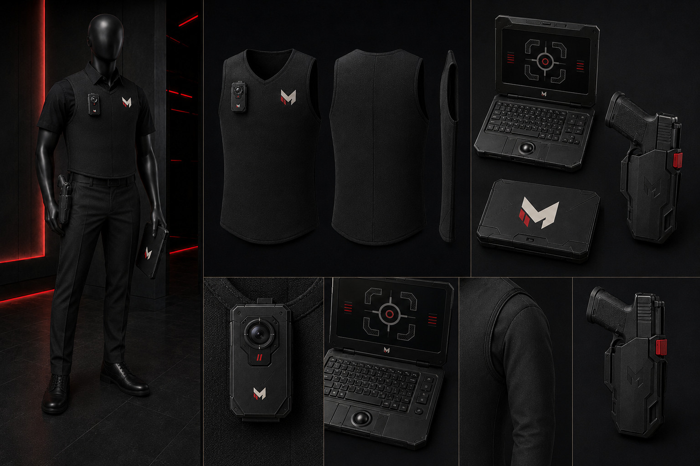

# McCluster Corp Security Officer Identity

This directory controls the visual identity of McCluster Corp security officers. This role is separate from a cohort operator, police officer, soldier, or SWAT officer.

## SOI-01 — Authority Black

SHA-256: `3f44e5c1119bbbf19080914edb46d31d76e288f16d5ee41dcf1ce241ecdced62`

## Locked equipment ceiling

The standard security officer carries only:

1. Corporate clothing foundation
2. One ultra-thin protective vest
3. One properly mounted body camera
4. One McCluster cyberdeck
5. One compact sidearm in one low-profile retention holster

No watch, earpiece, drives, cable wallet, loose cables, mystery modules, extra pouches, spare weapons, long gun, or SWAT equipment belongs to the standard identity.

## Role language

The security officer protects McCluster personnel, facilities, information systems, and continuity of operations. The visual must remain corporate and cyber-first. Defensive equipment is minimal, deliberate, and subordinate to mobility and professional presentation.

## Production warning

This JPG controls styling and equipment logic; it is not manufacturing artwork. All official marks must be placed from `../marks/`. Never crop, trace, or regenerate identity from the render.
