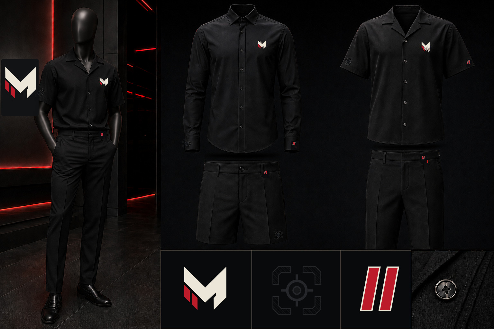

# McCluster Corp corporate-wear style sheet

## Direction locked by the brand owner

**Wealth, not riches.** This is private-client corporate issue—the luxury collection that never reaches a public rack. It is not merch, a public drop, Supreme-type hype, a loud matching monogram set, or a costume.

- Faceless matte-black atelier mannequin; no human model or accidental character identity
- Authority-black garments with adult professional tailoring
- Value expressed through fabric, proportion, drape, buttons, seams, and finish
- Small exact M used as a house signature, never a generic letter
- Exact Dual Sight used tonally, black-on-black, and discovered up close
- Exact Two States `//` used as micro red punctuation
- Trousers and tailored shorts stay nearly plain
- Negative space is mandatory

## Capsule shown

| Piece | Exterior identity ceiling |
|---|---|
| Long-sleeve button-up | One small M, one tonal Dual Sight, one micro `//` |
| Short-sleeve camp-collar shirt | One small M, one tonal Dual Sight, one micro `//` |
| Tailored city shorts | One tonal Dual Sight and one micro `//`; no repeat |
| Professional trousers | Optional near-invisible M and one micro `//`; no repeat |

## Identity source rule

The render establishes styling, placement logic, and material mood. The exact marks displayed in the detail row and all production artwork are governed by these masters:

- `assets/canon/brands/mccluster-corp/marks/mccluster-m-emblem-master.svg`
- `assets/canon/brands/mccluster-corp/marks/mccluster-dual-sight-master.svg`
- `assets/canon/brands/mccluster-corp/marks/mccluster-two-states-master.svg`

Never crop a mark from this PNG for manufacturing. Never ask an image model to reproduce it. Place the master vector itself; if exact placement is not possible, leave the garment blank.

## Controlling document

All future clothing, costume, styling, vendor, and AI work must follow [`PRIVATE-CLIENT-FASHION-GUIDE.md`](PRIVATE-CLIENT-FASHION-GUIDE.md).
