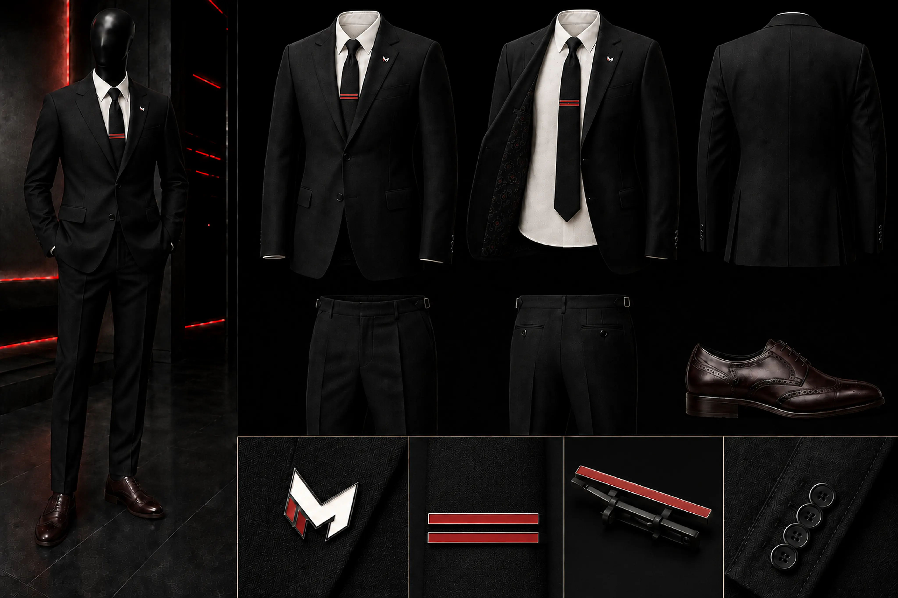

# McCluster Corp Executive Skin

## EI-01 — Executive Authority

## Role distinction

This is the highest boss-level corporate skin. Its authority comes from tailoring, restraint, and material quality. It is not an embellished version of corporate casual wear and is not an operator or security uniform.

## Locked specification

| Component | Canon direction |
|---|---|
| Jacket | Modern American single-breasted two-button black suit; notch lapels |
| Trousers | Matching black tailoring; side adjusters; no belt |
| Shirt | Warm ivory-white executive shirt |
| Tie | Plain black silk; no printed branding |
| Lapel | Exact M as a small jewelry-grade pin |
| Tie clip | Two stacked horizontal red enamel stripes; the stripes themselves are the clip; no visible carrier bar |
| Shoes | Dark oxblood-brown wingtips |

## Identity-source rule

The render establishes the executive skin's appearance. Production must use the exact master marks in `assets/canon/brands/mccluster-corp/marks/`. Omit a mark rather than approximate it.
